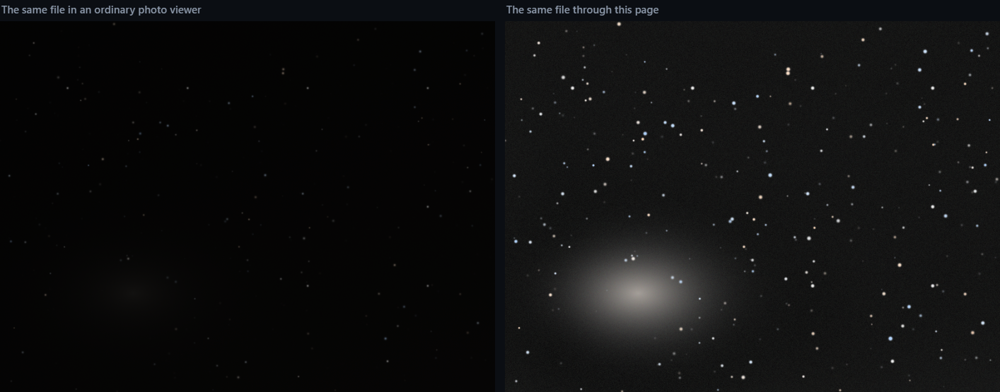

# Stretch

A single web page that opens an astronomy photo and brightens it so you can see
what is in it — and writes down everything it did.

Download one file. Double-click it. Drag your photo onto it. That is the whole
thing.



*One of the repository's own test frames, before and after. The panel on the
left is the file exactly as it is stored; the one on the right is what this page
does with it — including the star colours, which survive the stretch instead of
being washed out by it. Both are generated by
`test/fixtures/fixture-gradient.fit`, which is synthetic — no one else's data is
in this repository.*

---

## Nothing you open here is uploaded

The page does not talk to the internet. Not to us, not to anyone.

**Don't take that on trust — it takes ten seconds to check:**

> **Turn off your Wi-Fi. Then use it.**
>
> It works exactly the same. A page that needed a server would stop.

If you want the stronger version: open your browser's developer tools (`F12`),
click the **Network** tab, and process a photo. **Nothing goes out.** You will
see exactly one entry, and it starts with `blob:` — that is the page handing its
own code to a background thread inside your browser, from memory. A `blob:`
address is not on the internet; it cannot leave the tab. Every other kind of
entry — an `http://` or `https://` to anywhere — is absent, and there is no code
in the file that could produce one.

There is no account, no sign-in, no upload button, and no analytics. There is
no server to send anything to — the file you downloaded *is* the program. You
can open it in a text editor and read it. That is not a figure of speech; it is
one file of readable code with no minification and no external libraries, and
the [repository](https://github.com/justyear/fits-stretch) has the tests that
prove it does what it says.

---

## Using it

1. **[Download `index.html`](https://github.com/justyear/fits-stretch/releases/latest/download/index.html)**
   — that link saves the file straight to your downloads folder.

   *If you are browsing the repository instead:* clicking `index.html` in the
   file list shows you the **code**, not the program — a page of syntax
   highlighting, with no way to run it. The button you want is at the top right
   of that view: the **⤓ download icon**, whose tooltip reads *Download raw
   file*. `Ctrl+S` on that screen saves GitHub's page, not the tool.

2. Double-click the downloaded file. It opens in your browser like any other
   page. There is no installer and nothing to allow.
3. Drag a `.fit`, `.fits` or `.fz` file onto it.
4. Look at the result. Download the picture, and the log if you want it.

No installation. No Python, no dependencies, nothing to keep updated. It works
offline, on a laptop on a mountain.

**Browsers.** Tested in Firefox and Chrome, on Windows, both from a local
server and by double-clicking the file. **Safari has not been tested** — not
because it is expected to fail, but because no one has run it there. If you use
Safari, treat it as unverified; the checks further down are the same ones that
would tell you.

### If you have never heard of FITS

FITS is the file format telescopes and astronomy cameras write. It is not a
photo format — it is a table of measurements, one number per pixel, stored at
full precision and with the camera's settings recorded alongside.

Those numbers are almost always *very* dark. A real night sky is mostly black
with faint smudges, and if you open a FITS file in an ordinary photo viewer you
usually see a black rectangle. The picture is in there; it just needs to be
stretched so your eyes can reach it.

That is what this page does, and the reason it exists as a separate tool is
that stretching is where most software quietly starts making things up.

---

## The log

Every image comes with one. This is the whole log for the frame at the top of
this page — not a sample, not an illustration, the actual file:

```
Processed with Stretch, a one-page FITS autostretch that runs in the browser.
Nothing was uploaded. The file never left this machine.

Processing log — fixture-gradient.fit
1600 × 1200 · 32-bit float · 3 channels · 2026-09-05

• Read the FITS: 32-bit IEEE float, 3 image planes, rows stored top-down. Pixel values were already on a 0–1 scale, and the data spans 0.00581 to 0.47135.
• No colour filter array: the file carries 3 separate colour planes (NAXIS3 = 3) and is already demosaiced. No debayer applied.
• Data is linear: median 0.01676, no stretch recorded in the header. Full autostretch applied.
• Background extraction: measured the sky in 108 boxes of 25 pixels on a 12 × 9 grid and used 92 of them (16 brighter than the background were left out). A thin-plate spline through those points is the model that was removed.
    Each channel got its own model median back as a pedestal (R 0.01831, G 0.01658, B 0.01505), so the background level is preserved and only its variation was removed.
    The ratio between channels is therefore unchanged: no colour grading, no white balance, nothing was decided about the colour of the sky.
• Colour calibration: the sky background was levelled between channels (R 0.001667, G -0.000067, B -0.001601 subtracted, additively, so only the floor moved).
    Stellar gains: the faintest star median is 0.044710, less than 3x the sky pedestal (0.016824); a ratio taken above the sky is unstable when the star is barely above it.
    Star selection is a brightness cut, not star detection: bright unsaturated pixels are predominantly stars in a star field. Pixels whose neighbourhood is also mostly selected are rejected as extended, which removes a galaxy core but would also remove a star field dense enough to look like one.
• Autostretch — midtones transfer function (PixInsight STF / Siril autostretch), shadow clip -2.80σ, target background 0.085 — that is 22 of 255. Applied LINKED: one curve, derived from the luminance, and every channel multiplied by the same number. Highlights untouched at 1.000.
    Luminance  median 0.01677  MADN 0.00106  →  shadows 0.01380  midtones 0.03144
    Because one curve governs all three channels, the ratio between them is unchanged by construction. Measured on this frame, the largest change to any channel ratio was 4.4e-16 across 1,918,104 pixels — float rounding, nothing else. In the highlights, R/G 1.0054 → 1.0098 and B/G 0.9994 → 0.9934.
    405 pixels came out above 1.0 in one channel. All three were divided by their own maximum rather than the bright channel being clipped on its own: clipping one channel changes the colour of the pixel, dividing takes it to white and keeps it.
    0.087% of pixels were clipped by the transfer itself — luminance at or below the black point, or at or above 1.0. That is a different count from the line above: this one is the curve, that one is the overflow.
• Output: 8-bit sRGB, full resolution, no resampling. Rounded with ±0.5 of a level of dither, from the fixed seed 20260906, which breaks the banding a subtracted surface would otherwise leave. The seed is fixed, so the same file always produces the same image.
• Not applied: noise reduction, sharpening, saturation, deconvolution, star removal, colour grading, or any AI or generative step.

Every number above was measured from the file itself.
```

The date on the second line, `2026-09-05`, is the day this golden was captured
and is deliberately frozen there — a log that printed today's date could not be
compared byte for byte against a stored one. Your own runs print the day you
ran them.

Every figure there was read off the frame: 92 of 108 sample boxes accepted, a
luminance median of 0.01677, 405 pixels that overflowed, 0.087% clipped by the
curve. If the tool ever produced a different one, you would know — that text is
stored in the repository as `test/golden/gradient-fixture.log.txt` and compared
**byte for byte** on every run. Not "close enough": exact. A log that drifts by
one digit is a failure, because the numbers in it are the evidence.

**Read the sixth bullet again.** On this frame the colour calibration levelled
the sky and then *declined to go further*: the stars here sit too close to the
sky for a colour measured against them to mean anything, so it says the number,
says the rule, and stops. That is the part worth having. A tool that always
produces an answer is not measuring — it is guessing and rounding to something
plausible, and you would have no way to tell the two apart.

---

## What it does not do

The log every image comes with ends with a sentence like this one:

> Not applied: noise reduction, sharpening, saturation, deconvolution, star
> removal, colour grading, or any AI or generative step.

That sentence is generated, not typed. It is the list of everything the tool
knows how to name, minus whatever actually ran. If a step is ever added and it
runs, the sentence drops that word by itself. It cannot go stale, because
nobody maintains it.

**Nothing here invents detail.** No neural network, no upscaling, no
"enhancement". Every number in the log was measured from your file, and the log
says which.

What it *does* do, and says so:

- reads the FITS, including Rice-compressed `.fz`
- demosaics a colour-filter-array frame when there is one
- removes the light-pollution gradient, if it can measure one
- **levels the sky between the three channels**, by subtraction, so no channel
  starts higher than the others just because the sky was brighter in it
- **measures the colour balance from the stars in your own frame** — the ratio
  of their brightness in each channel, taken above the sky — and applies it as a
  gain. No catalogue, no plate solve, nothing consulted. If the stars are too
  faint against the sky for that ratio to mean anything, it says so and does not
  apply a gain
- applies the standard autostretch (the PixInsight/Siril midtones transfer),
  **linked**: one curve derived from the luminance, and all three channels
  multiplied by the same number, so the ratio between them survives the stretch
  instead of being flattened by it
- writes an 8-bit PNG, and a log describing all of the above with numbers

Those middle three are the difference between v1.0 and today. The stretch used
to run each channel through its own curve, which quietly changes the colour of
everything — an undeclared white balance, which is the one thing the sentence
above promises not to do. Measured on a real stack: stellar ratios R/G 1.054 and
B/G 0.714 going in, R/G 1.008 and B/G 0.950 coming out. The curve ate the
colour. Now the largest change to any channel ratio is **4.4e-16**, and the log
prints that number on every run rather than claiming it.

---

## Checking it yourself

Everything below is optional. It is here because a tool that asks you to trust
it should hand you the means to stop trusting it.

**The verification suite is Windows and PowerShell.** The tool itself is not —
it is one HTML file and runs anywhere a browser does — but the scripts that
check it are `.ps1`, they use no modules and nothing installed, and they have
only been run on Windows PowerShell 5.1. On another platform you would be
porting them, not running them.

```
powershell -File .claude\make-fixture.ps1        # build the test images
powershell -File .claude\serve.ps1 -Port 8791    # a local static server
```

Then open `http://127.0.0.1:8791/test.html`, paste the contents of
`test/capture-golden.js` into the browser console, and run it:

```js
await __captureAll()
```

**That paste is the one manual step, and it is manual on purpose.** The obvious
move is to drive the page from a headless browser and have a single command do
everything. That was tried. Headless Chrome does not advance timers inside a
Web Worker under `--virtual-time-budget`, which is where this page does its
work, so it reported a failure that was not real — and a false failure from
your test harness is worse than no harness, because you cannot tell it apart
from a genuine regression. Until there is a driver whose failures can be
trusted, the capture is something you watch happen. Everything after it is
automated:

| command | the question it answers |
|---|---|
| `test\compare-golden.ps1` | is today's output the same as yesterday's? |
| `test\compare-reference.ps1` | do the numbers agree with a separate implementation, written in Python, that shares none of this code? (249 comparisons across six test frames; the four that stay unanswered are the ones the Python declines to cover, and it declines them in its own output rather than being excused here) |
| `test\negative-controls.ps1` | can those checks still fail? (28 deliberate breakages, each of which must be caught) |
| `test\compare-malformed.ps1` | what happens to a file that lies about itself? (33 broken files — impossible dimensions, a header with no end, a compressed table pointing outside the file — each with the verdict it must keep getting) |
| `test\compare-truth.js` | is the fitted background the gradient we *put into* the test image — checked against numbers stored in the file's own header, which came from neither implementation? |
| `build\build.ps1 -Check` | is the published file exactly what this source builds — and is every number written down about it still true? |

The test images are synthetic and generated from a fixed seed, so they are
reproducible and no one has to trust them either. **No frame from anyone else
is in this repository.**

`test/golden/MANIFEST.md` is the long version: what each test image covers, what
was measured, what is verified and what is not.

---

## Limits worth knowing

- **Very large frames depend on your browser's memory.** A stacked 4K frame in
  32-bit float is about 100 MB per channel, and the chain needs a few copies. If
  it runs out, it says so and tells you what to try.
- **`.fz` support covers `RICE_1`**, which is what Siril and `fpack` write by
  default. Other compressions are declined with an explanation.
- **The background extraction is automatic and has no manual override yet.** It
  shows you every sample it took and why it rejected the ones it rejected, but
  you cannot yet move them by hand. If it makes a bad call on your frame, that
  is a real limitation today.
- **It has been tested against synthetic frames and a second implementation, not
  against a large collection of real files.** The measurements are honest about
  which is which.
- **A file that lies about itself is refused, not guessed at.** 33 deliberately
  broken files are part of the test suite, and each one has to keep getting the
  same answer. The failure the suite watches hardest for is the quiet one: a
  file that used to be refused starting to produce a picture. It has caught that
  exact thing once — a `.fz` whose table pointed two billion bytes past the end
  of a 14 kB file was decoding into a blank frame with no error at all.

---

## Licence

MIT. Use it, change it, ship it, put it on your club's website. See `LICENSE`.

The licence is also in a comment at the top of `index.html`, because that file
travels alone — someone will email it to someone else, and at that point this
README is not there any more.
